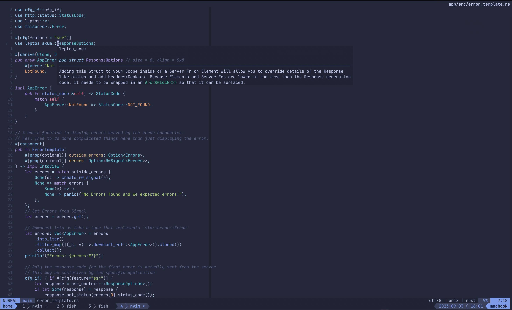

# Nixvim template

[](https://opensource.org/license/mit/)

My Minimalist Neovim config.
Banish those unworthy [soydev](https://storopoli.io/2023-11-10-2023-11-13-soydev/)
IDEs to the depths of Hell!



## How to Use

Just run anywhere with Nix:

```bash
nix run github:storopoli/neovix
```

Or clone the repo and run:

```bash
nix run .
```

Additionally, you can use it as a flake:

```nix
{
  # ...
  inputs.neovix = {
    url = "github:storopoli/neovix";
    inputs = {
      nixpkgs.follows = "nixpkgs";
      flake-parts.follows = "flake-parts";
    };
  };

  outputs = inputs @ { self, ... }:
  {
    imports = [
      {
        nixpkgs.overlays = [
          # ...
          inputs.neovix.overlays.default
        ];
      }
    ];
  };

}
```

Then `neovix` will be available as `pkgs.neovix`.

## Local Configurations with `exrc`

Local settings can be configured by  creating a `.nvim.lua` file in the project's
root directory.
If neovim is launched in the same directory as `.nvim.lua`,
it will evaluate your user configuration first,
followed by the local configuration.

An example `.nvim.lua` might be as follows:

```lua
local nvim_lsp = require('lspconfig')

nvim_lsp.rust_analyzer.setup({
  root_dir = function()
    return vim.fn.getcwd()
  end
})
```

## License

The source code is licensed under a
[MIT License](https://opensource.org/license/mit/).

[](https://opensource.org/license/mit/)
