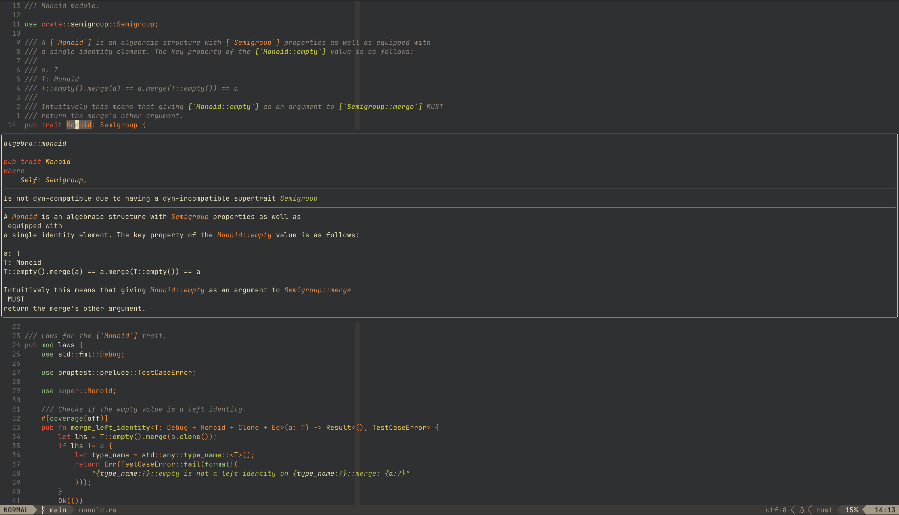

# Nixvim template

[](https://opensource.org/license/mit/)

My Minimalist Neovim config.
Banish those unworthy [soydev](https://storopoli.com/posts/2023-11-10-soydev.html)
IDEs to the depths of Hell!



## How to Use

Just run anywhere with Nix:

```bash
nix run github:storopoli/neovix
```

Or clone the repo and run:

```bash
nix run .
```

Additionally, you can use it as a flake:

```nix
{
  # ...
  inputs.neovix = {
    url = "github:storopoli/neovix";
    inputs = {
      nixpkgs.follows = "nixpkgs";
      flake-parts.follows = "flake-parts";
    };
  };

  outputs = inputs @ { self, ... }:
  {
    imports = [
      {
        nixpkgs.overlays = [
          # ...
          inputs.neovix.overlays.default
        ];
      }
    ];
  };

}
```

Then `neovix` will be available as `pkgs.neovix`.

## `init.lua`

This config boils down to the following `init.lua` config (requires `neovim` version `0.12` or higher):

```lua
-------------------------------------------------------------------------------
-- DEPENDENCIES
-- neovim >=0.12 ripgrep fd fzf
-------------------------------------------------------------------------------

-- Options
-- Set highlight on search
vim.o.hlsearch = false
vim.o.incsearch = true
vim.o.nu = true
vim.o.relativenumber = true
vim.o.tabstop = 2
vim.o.softtabstop = 2
vim.o.shiftwidth = 2
vim.o.expandtab = true
vim.o.hidden = true
vim.o.laststatus = 3
vim.o.winbar = "%=%m %f"
vim.o.mouse = "a"
-- Scrolling
vim.o.scrolloff = 8
vim.o.sidescrolloff = 8
-- Time in milliseconds to wait for a mapped sequence to complete
vim.o.timeoutlen = 500
vim.o.ttyfast = true
vim.o.wrap = false
vim.o.breakindent = true
-- Better undo history
vim.o.swapfile = false
vim.o.backup = false
vim.o.undodir = vim.fn.stdpath("data") .. "/undo"
vim.o.undofile = true
vim.o.ignorecase = true
vim.o.smartcase = true
vim.o.updatetime = 500
vim.wo.signcolumn = "yes"
vim.o.colorcolumn = "80"
vim.o.splitbelow = true
vim.o.splitright = true
vim.o.list = true
vim.opt.listchars = { tab = "» ", trail = "·", nbsp = "␣" }
vim.o.winborder = "rounded"
--  NOTE: Must happen before plugins are required (otherwise wrong leader will be used)
vim.g.mapleader = " "
vim.g.maplocalleader = " "

-- Plugins
vim.pack.add({
  "https://github.com/echasnovski/mini.completion",
  "https://github.com/ibhagwan/fzf-lua",
  "https://github.com/neovim/nvim-lspconfig",
})

-- FZF-lua
require "fzf-lua".setup { defaults = { git_icons = false } }
vim.api.nvim_set_keymap("n", "<C-\\>", [[<Cmd>lua require"fzf-lua".buffers()<CR>]], {})
vim.api.nvim_set_keymap("n", "<C-k>", [[<Cmd>lua require"fzf-lua".diagnostics_workspace()<CR>]], {})
vim.api.nvim_set_keymap("n", "<C-p>", [[<Cmd>lua require"fzf-lua".global()<CR>]], {})
vim.api.nvim_set_keymap("n", "<C-l>", [[<Cmd>lua require"fzf-lua".live_grep()<CR>]], {})
vim.api.nvim_set_keymap("n", "<C-g>", [[<Cmd>lua require"fzf-lua".grep_project()<CR>]], {})
vim.api.nvim_set_keymap("n", "gs", [[<Cmd>lua require"fzf-lua".lsp_document_symbols()<CR>]], {})
vim.api.nvim_set_keymap("n", "gS", [[<Cmd>lua require"fzf-lua".lsp_live_workspace_symbols()<CR>]], {})

-- Completion
require("mini.completion").setup{}

-- LSP Diagnostics
vim.diagnostic.config({ virtual_text = false, virtual_lines = { current_line = true } })

-- LSPs
-- Auto-starts LSP when a buffer is opened, based on the lsp-config
-- `filetypes`, `root_markers`, and `root_dir` fields.
vim.lsp.enable({
  "lua_ls",
  "hls",
  "rust_analyzer",
  "nil_ls",
  "nixd",
  "taplo",
  "yamlls",
  "bashls",
  "pyright",
  "ruff",
})

-- LSP keymaps
vim.keymap.set("n", "gd", vim.lsp.buf.definition, {})
vim.keymap.set("n", "gD", vim.lsp.buf.implementation, {})
vim.keymap.set("n", "gr", vim.lsp.buf.references, {})
vim.keymap.set("n", "gi", vim.lsp.buf.type_definition, {})
vim.keymap.set("n", "K", vim.lsp.buf.hover, {})
vim.keymap.set("n", "<leader>f", vim.lsp.buf.format, {})
vim.keymap.set("n", "<leader>r", vim.lsp.buf.rename, {})
vim.keymap.set("n", "<leader>a", vim.lsp.buf.code_action, {})
```

## Neovimer's Creed

This is my neovim config.
There are many like it, but this one is mine.

My neovim config is my best friend.
It is my life.
I must master it as I must master my life.

Without me, my neovim config is useless.
Without my neovim config, I am useless.
I must edit my neovim config true.
I must code more efficiently than my enemy who is trying to outcode me.
I must outcode him before he outcodes me.
I will...

My neovim config and I know that what counts in coding is not the plugins we install,
the noise of our mechanical keyboards,
nor the smoke tests we run.
We know that it is the commits that count.
We will commit...

My neovim config is human, even as I, because it is my life.
Thus, I will learn it as a brother.
I will learn its weaknesses, its strength, its parts, its accessories,
its themes, and its plugins.
I will keep my neovim config clean and ready, even as I am clean and ready.
We will become part of each other.
We will...

Before Git, I swear this creed.
My neovim config and I are the defenders of my codebase.
We are the masters of our enemy.
We are the saviors of my projects.

So be it, until victory is Open Source's and there is no enemy, but peace!

## License

The source code is licensed under a
[MIT License](https://opensource.org/license/mit/).

[](https://opensource.org/license/mit/)
